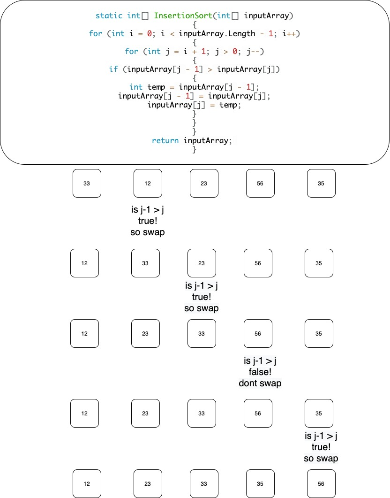

Insertion Sort
Provide a visual step through for each of the sample arrays based on the provided pseudo code

On the first go through i is set to the length of the array passed in minus 1. Then the next line runs and sees if the 1st position in the array is less then the 0 position and if it is it swaps them and continues. Then the 2nd position is checked against the 1st if it is less then the second then it moves and checks position 0.

Merge Sort

ALGORITHM Mergesort(arr)
    DECLARE n <-- arr.length
-- Takes in an array and then sets a variable n of the legnth of the array input.
**Example: arr.Length = 6 so n = 6**
**Example: arr = [23, 75, 67, 89, 1001, 76]

    if n > 1
      DECLARE mid <-- n/2
      DECLARE left <-- arr[0...mid]
      DECLARE right <-- arr[mid...n]
-- Checks if n is greater than 1 and if it is then sets the mid to n/2
**Example: n = 6 then mid = 3 left = [0,1,2] right = [3, 4, 5]**

      // sort the left side
      Mergesort(left)
**Example: [23, 67, 75]**
      // sort the right side
      Mergesort(right)
**Example: [76, 89, 1001]
      // merge the sorted left and right sides together
      Merge(left, right, arr)

ALGORITHM Merge(left, right, arr)
    DECLARE i <-- 0
    DECLARE j <-- 0
    DECLARE k <-- 0
**[23, 67, 75]** <= i
**[76, 89, 1001]** <= j
**[23, 75, 67, 89, 1001, 76]** <=k

    while i < left.length && j < right.length
        if left[i] <= right[j]
            arr[k] <-- left[i]
            i <-- i + 1
        else
            arr[k] <-- right[j]
            j <-- j + 1
            
        k <-- k + 1

-- Checks to make sure the arrays are even length and if they are they check both 0 position to see which one needs to be added first and then repeats that untill finished
**Example if[23] <= [76]**
**array k[23,]**
** i++ **

**Example if[67] <= [76]**
**array k[23, 67,]**
** i++ **

**Example if[67] <= [76]**
**array k[23, 67, 75]**
** i++ **

** Now i = 3 which makes i == left.Length "true" so we set the remaining right all ready sorted values into the array**
**[23, 75, 67, 89, 1001, 76]**

    if i = left.length
       set remaining entries in arr to remaining values in right
    else
       set remaining entries in arr to remaining values in left
