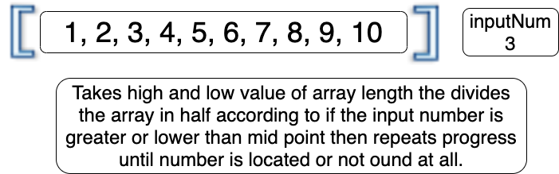

# Array Challenges

1. Reverse an Array

Input: array
Output: same array reversed

2. Array switch

Input: array and a number to insert
Output: a new array with the input number in the middle of the old array

3. Binary search

Input: Array and a number to find in the array
Output: The output will be the umber if it is located in the array otherwise it will be -1

--------------------------------------------------------------------------------
4.  LinkedList

- [x] Can successfully instantiate an empty linked list
- [x] Can properly insert into the linked list
- [x] The head property will properly point to the first node in the linked list
- [x] Can properly insert multiple nodes into the linked list
- [x] Will return true when finding a value within the linked list that exists
- [x] Will return false when searching for a value in the linked list that does not exist
- [x] Can properly return a collection of all the values that exist in the linked list

5. LinkedList AddBefore, AddAfter, AppendToEnd

# Challenge Summary
In this code challenge we had to:
1. append a node to the end of the linked list
2. add a new node before a given node
3. add a new node after a given node

## Approach & Efficiency
Took existing challenges to help understand the flow and how to set and chnage position on new node

## Solution

# Challenge Summary
In this code challenge we had to:
1. user gives a number to search that many nodes from the end
2. then loop through again and print the value of that node

## Approach & Efficiency
started by looping through list to find the length and then took the length minus the inout value to go through the list again that many times

## Solution

# Challenge Summary
In this code challenge we had to:
1. Take in 2 different linked list
2. Filled new linked list with alternating values from each list

## Approach & Efficiency
Bring in both linked list then iterated over both and take one from each from each pass through and fill in the new empty list

## Solution

# Challenge Summary
In this code challenge we had to:
1. Use Stacks
2. Create tests to be able to Push, Pop, Peek, IsEmpty on the stacks
3. Use Queues
4. Create tests to be able to Enqueue, Dequeue, Peek, IsEmpty on the queue

## Approach & Efficiency
Create both a Stack and a Queue then write tests to prove functinality

## Solution

# Challenge Summary
Create a stack that acts like a queue 

## Challenge Description
Create two stacks and when a new value is added to the stack take the existigng values pop them into the new stack and then add new value to first stack and then pop all the values from stack two back on to stack one 

## Solution

